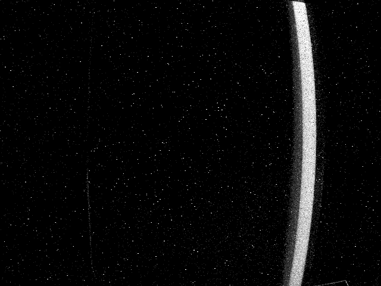
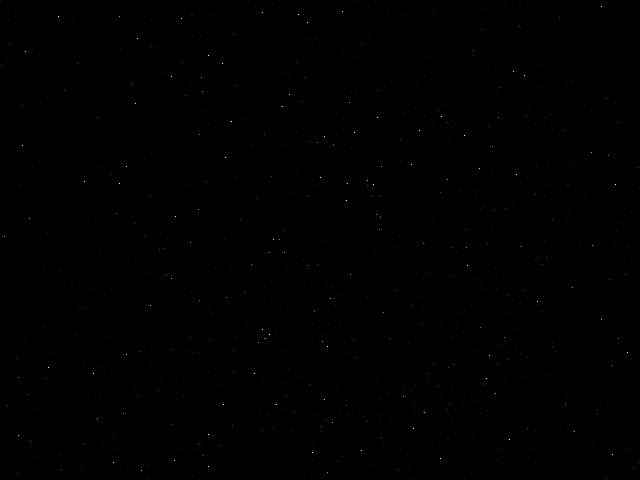
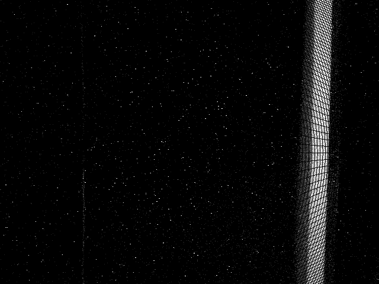
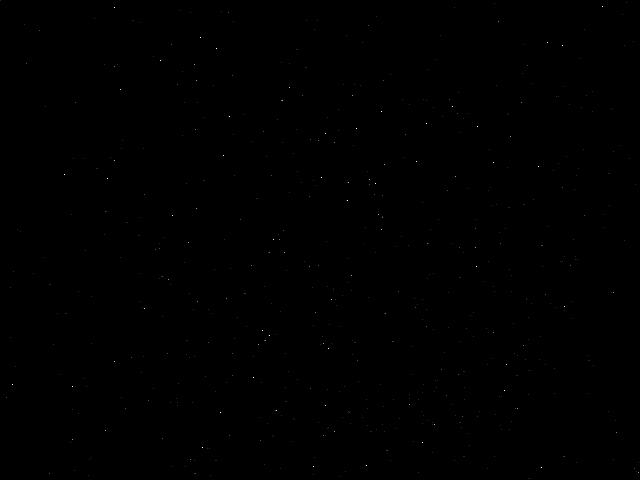

# 📌 Proje Başlığı
**Olay Kamerası Tabanlı Görüntüleme Sistemleri İçin Özgün Kalibrasyon Yöntemi Geliştirilmesi ve Uygulanması**

# 📋 Proje Bilgileri
- **Proje Numarası:** 123E693
- **Proje Yürütücüsü:** Dr. Öğr. Üyesi Gökhan Koray Gültekin

---

## 📖 Proje Açıklaması
Bu proje, olay (event-based) kameralar için özel olarak tasarlanmış ve yüksek doğruluk sağlayan yeni bir kalibrasyon yöntemi geliştirmeyi ve uygulamayı amaçlamaktadır. Olay kameralarının, geleneksel kare tabanlı sistemlerden farklı veri çıkışı karakteristikleri dikkate alınarak, hem teorik hem de deneysel çalışmalarla kalibrasyon parametrelerinin iyileştirilmesi hedeflenmektedir.

---

## 📂 Veri Kümesi
Veri kümesine aşağıdaki bağlantı üzerinden erişebilirsiniz:  
🔗 [Veri Setlerini İndir](https://drive.google.com/)

Her bir klasörde şu içerikler bulunmaktadır:
- Ham olay verisi (`.aedat4` veya `.dat` formatında)
- Olay verilerinin .csv formatı

---

## 📷 Kamera Özellikleri
| Özellik                | Değer                                                                                                                                   |
|:----------------------:|:-----------------------------------------------------------------------------------------------------------------------------------------|
| **Mekansal Çözünürlük** | 640 × 480                                                                                                                               |
| **Zamansal Çözünürlük** | 200 µs                                                                                                                                   |
| **Tipik Gecikme**       | < 1 ms                                                                                                                                  |
| **Maksimum Veri Akışı** | 165 MEPS (Milyon Olay/Saniye)                                                                                                           |
| **Dinamik Aralık**      | • ~90 dB (3–100k lüks, %99.9 piksel %27.5 kontrasta tepki)    • ~110 dB (0.3–100k lüks, %50 piksel %80 kontrasta tepki) |
| **Kontrast Hassasiyeti**| • 13% (%50 piksel tepki)    • 27.5% (%99.9 piksel tepki)                                                               |

---

## 📈 Örnek Görselleştirmeler
Aşağıda işlenmiş bazı olay verilerine ait görselleştirme örneklerini bulabilirsiniz:

<table>
  <tr>
    <td align="center">
      <strong>Düzeltilmemiş Olay Verisi</strong> 
       
      
    </td>
    <td align="center">
      <strong>Düzeltilmiş Olay Verisi</strong> 
       
      
    </td>
  </tr>
</table>

---

## 🎥 Olay Verilerinin Kareleştirilmesi

Olay kameraları, geleneksel kare tabanlı kameraların aksine yalnızca sahnedeki değişiklikleri zamana bağlı olarak kaydeder.  
Bu proje kapsamında olay verileri, belirli sayıda (örneğin 500 olay) gruplandırılarak kare (frame) formatında yeniden yapılandırılmıştır.

Bu yöntem sayesinde:
- Olaylar zamana bağlı değil, olay yoğunluğuna bağlı olarak biriktirilir.
- Görselleştirme ve kalibrasyon adımları için daha dengeli veri setleri oluşturulur.
- Düşük aydınlatma veya hızlı hareket gibi zorlu koşullarda bile tutarlı kareler elde edilir.

Aşağıda, olayların biriktirilmesi sonucu oluşturulan örnek görseller yer almaktadır:

  

---
## 📬 İletişim

Her türlü soru, öneri veya iş birliği için aşağıdaki e-posta adresi üzerinden iletişime geçebilirsiniz:

- 📧 Gökhan Koray Gültekin: [gkgultekin@aybu.edu.tr](mailto:gkgultekin@aybu.edu.tr)
